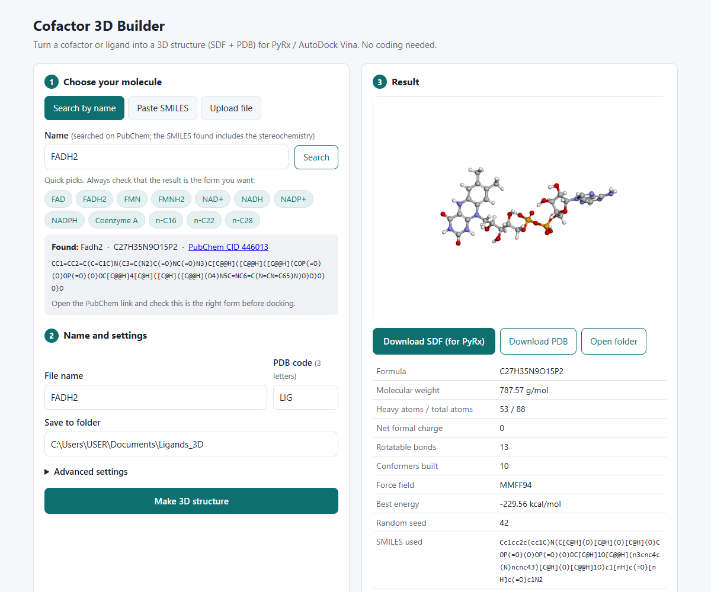

# Cofactor 3D Builder

**A no-code tool that turns a cofactor or ligand into a docking-ready 3D structure (SDF + PDB).**

Type a name such as *FAD*, *NADPH* or *hexadecane*, paste a SMILES, or upload a 2D file. The tool builds and energy-minimises a 3D structure with [RDKit](https://www.rdkit.org/) and saves it for PyRx, AutoDock Vina or any other docking program. It runs in your web browser, on your own computer, and needs no coding.



## 🚀 Quick start (Windows, 3 steps, no coding)

| Step | What to do | How often |
|---|---|---|
| **1** | Install **Python** from [python.org/downloads](https://www.python.org/downloads/). ⚠️ On the first installer screen, **tick "Add python.exe to PATH"**. | once |
| **2** | **[⬇️ Download the tool (ZIP)](https://github.com/viduminialwis/cofactor-3d-builder/archive/refs/heads/main.zip)**, right-click the ZIP and choose **Extract All**, then open the folder and double-click **`Install first time.bat`**. Wait until it says *Done!* | once |
| **3** | Double-click **`Start Cofactor 3D.bat`**. The tool opens in your web browser. | every time |

Keep the black window open while you use the tool, and close it when you have finished. Your 3D files are saved in **`Documents\Ligands_3D`**.

Something not working? See [Troubleshooting](#troubleshooting).

## Why this tool?

Building 3D ligands from SMILES with a script is quick, but it is easy to get wrong without noticing:

- **Missing stereochemistry.** If a SMILES has no `@`/`@@`, RDKit picks the stereocentres at random. For cofactors like FAD or NAD(P)H you can end up docking an L-sugar or a mixed isomer, and the formula still looks correct. **This tool stops and warns you** when stereocentres are undefined.
- **Wrong redox form or tautomer.** For example, a hand-written "FADH2" SMILES can be a 4a,5-dihydro tautomer instead of the true 1,5-dihydroflavin. Fetching the structure from **PubChem by name** avoids this, and the tool shows the PubChem CID so you can check it.
- **One random conformer.** The tool builds several conformers and keeps the lowest-energy one, with a fixed random seed so every run is reproducible.
- **Poor record keeping.** Every run is logged (SMILES, seed, force field, energy) in a CSV file, so you can write your Methods section later.

## Features

- Three input options: **search by name** (PubChem), **paste SMILES**, or **upload** `.sdf` / `.mol` / `.mol2` / `.smi` files
- Quick-pick buttons for common cofactors (FAD, FADH2, FMN, FMNH2, NAD⁺, NADH, NADP⁺, NADPH, CoA) and n-alkanes (n-C16, n-C22, n-C28)
- Guard against undefined stereochemistry, which you can override for achiral molecules such as alkanes
- Removal of salts and water: only the largest fragment is kept
- Interactive 3D preview in the browser ([3Dmol.js](https://3dmol.csb.pitt.edu/))
- Output as **SDF** (keeps bond orders; recommended for PyRx) and **PDB** (with a residue code you choose)
- Optional multi-conformer SDF for ensemble docking
- `generation_log.csv` recording every structure you make

## Installation on Mac / Linux

Open a Terminal inside the downloaded folder and run:

```bash
pip install -r requirements.txt
python cofactor3d_app.py
```

The tool opens in your browser. If it doesn't, go to <http://127.0.0.1:8765>.

## How to use

1. **Choose your molecule.** Search by name, paste a SMILES or upload a file. When searching by name, open the PubChem link and check that it is the form you want, for example oxidised vs reduced.
2. **Name it**, and optionally set a 3-letter PDB residue code (e.g. `FAD`, `FDA`, `NDP`).
3. Click **Make 3D structure**. Check the 3D preview, then use the **SDF** file for docking.

Files are saved to `Documents\Ligands_3D` by default. To change this, create a `settings.json` file next to `cofactor3d_app.py`:

```json
{"output_folder": "D:\\My project\\Docking\\Ligands_3D"}
```

## Method

1. The input is parsed with RDKit. Only the largest fragment is kept, and undefined tetrahedral or double-bond stereocentres are detected; phosphorus and sulfur centres are ignored.
2. Hydrogens are added, and *n* conformers (default 10) are embedded with **ETKDGv3** (random seed 42 by default).
3. Each conformer is optimised with **MMFF94**, or UFF if MMFF94 parameters are missing.
4. The **lowest-energy conformer** is written as SDF and PDB.

**Method references:**
- ETKDG: Riniker S, Landrum GA (2015). *J Chem Inf Model* 55:2562–2574.
- ETKDGv3: Wang S, Witek J, Landrum GA, Riniker S (2020). *J Chem Inf Model* 60:2044–2058.
- MMFF94: Halgren TA (1996). *J Comput Chem* 17:490–519.

Example Methods sentence (please adapt it to your settings):

> Three-dimensional structures of the cofactors were obtained from PubChem isomeric SMILES and generated with RDKit (version X) using the ETKDGv3 algorithm (10 conformers, random seed 42), followed by MMFF94 geometry optimisation. The lowest-energy conformer was used for docking.

## Limitations

- **Testing:** tested on Windows 11 with Python 3.14 and RDKit 2026.03. Mac and Linux should work but have not been tested yet; please report any problems.
- **Privacy:** the tool runs only on your own computer (`127.0.0.1`) and only accepts requests from its own page. Nothing you draw or upload is sent anywhere, except a **name search**, which sends the name you type to PubChem.
- **Metal-containing cofactors** (heme, Fe–S clusters, di-iron centres) cannot be built reliably. Take them from an experimental structure in the [PDB](https://www.rcsb.org/).
- **Protonation state:** PubChem SMILES are usually neutral (e.g. phosphates drawn as –OH). The tool does not protonate for a particular pH, so prepare the charge state in your docking software if you need to, and report it.
- A single minimised gas-phase conformer is a starting point. Docking programs such as Vina still treat rotatable bonds as flexible.
- The name search needs internet access to PubChem; the 3D preview needs internet to load 3Dmol.js. Building and saving work offline with SMILES or files.

## Troubleshooting

| Problem | Solution |
|---|---|
| *"Python was not found"* | Install Python (Quick start step 1) and make sure **"Add python.exe to PATH"** is ticked. If you already installed it without ticking, run the installer again, choose **Modify**, and tick it. |
| The black window says *"No module named rdkit"* | Run **`Install first time.bat`** first, and check that it ends with *Done!* |
| Windows shows *"Windows protected your PC"* | Click **More info**, then **Run anyway**. The `.bat` files are plain text, and you can open them in Notepad to see exactly what they do. |
| The browser did not open | Leave the black window open, and type <http://127.0.0.1:8765> in your browser's address bar. |
| *"Lost contact with the tool"* on the web page | The black window was closed. Double-click `Start Cofactor 3D.bat` again. |
| *"Could not reach PubChem"* | Check your internet connection and try again in a minute (PubChem is sometimes busy), or paste the SMILES instead. |
| The tool refuses because of *undefined stereocentres* | This protects you from docking a random isomer. Use **Search by name**, or copy the SMILES from PubChem. For molecules without stereocentres (e.g. alkanes), tick **Advanced settings → Allow undefined stereo**. |
| No 3D preview appears | The preview needs internet. Your SDF/PDB files are still created. |
| Something else | The error is saved in `error_log.txt` in the tool folder. Please [open an issue](https://github.com/viduminialwis/cofactor-3d-builder/issues) and attach it. |

## Data sources and acknowledgements

- **PubChem (NCBI/NLM).** The name search uses the public [PUG-REST](https://pubchem.ncbi.nlm.nih.gov/docs/pug-rest) web service. It retrieves only the CID, title, molecular formula and SMILES of the one compound you search for; no PubChem data is stored in or redistributed with this repository. The tool follows PubChem's [usage policy](https://pubchem.ncbi.nlm.nih.gov/docs/programmatic-access): at most 2 requests per second (the limit is 5), backing off when PubChem is busy, caching repeat searches, and sending a User-Agent that identifies this tool. This tool is independent and is **not affiliated with or endorsed by NCBI/NLM**; see the [NCBI policies and disclaimer](https://www.ncbi.nlm.nih.gov/home/about/policies/).
  If you use structures obtained through this tool, please cite PubChem as it requests:
  - Kim S, Chen J, Cheng T, et al. PubChem 2025 update. *Nucleic Acids Res.* 2025;53(D1):D1516–D1525. doi:[10.1093/nar/gkae1059](https://doi.org/10.1093/nar/gkae1059)
  - Kim S, Thiessen PA, Cheng T, Yu B, Bolton EE. An update on PUG-REST: RESTful interface for programmatic access to PubChem. *Nucleic Acids Res.* 2018;46(W1):W563–W570. doi:[10.1093/nar/gky294](https://doi.org/10.1093/nar/gky294)

  In your Methods, also give the **PubChem CID** of each compound you used; the tool shows it and writes it to `generation_log.csv`.
- **RDKit**, the open-source cheminformatics toolkit (BSD licence): <https://www.rdkit.org>
- **3Dmol.js**, for the 3D viewer (BSD licence): Rego N, Koes D. *Bioinformatics* 2015;31(8):1322–1324.

## Citation

If this tool helps your research, please cite it using the **"Cite this repository"** button on this page (see [`CITATION.cff`](CITATION.cff)). Please also cite RDKit.

## Author

**Vidumini Alwis**, MPhil researcher, Department of Zoology and Environment Sciences, University of Colombo, Sri Lanka · ORCID [0009-0004-6155-2295](https://orcid.org/0009-0004-6155-2295)

Developed with the help of Claude (Anthropic) as an AI coding assistant.

## License

[MIT](LICENSE): free to use, modify and share, with attribution.
